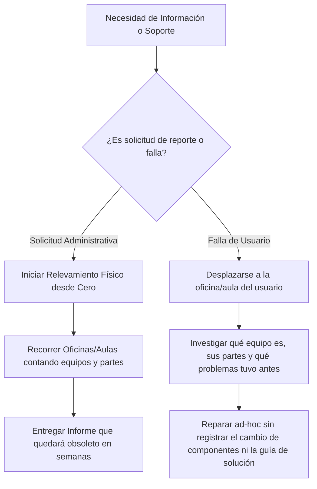

# Etapa 1: Identificación de la Problemática y Propuesta de Valor

> **Organización:** Dependencia del Ministerio de Educación de Tucumán  
> **Proyecto:** Sistema de Gestión Integral de TI  
> **Basado en:** Pautas de los documentos `U1-A1.pdf` y `U1-A3.pdf`
---

## 1. Contexto y Descripción del Problema

* **Tipo de organización / dominio:** Dependencia pública del Ministerio de Educación de la Provincia de Tucumán.
* **Origen del problema:** Las actividades del área de TI se ejecutan de manera informal y ad-hoc. No existen procesos estandarizados ni mantenidos en el tiempo.
* **Situación actual:** 
  - **Inventarios efímeros y redundantes:** Se realizan relevamientos físicos de computadoras y componentes que quedan obsoletos rápidamente debido a los movimientos cotidianos de equipos (cambios de aulas/oficinas) y reemplazos de partes durante mantenimientos sin un registro centralizado. Ante cada solicitud de la administración, el equipo TI debe volver a realizar el inventario desde cero.
  - **Desconocimiento del origen de componentes:** Al reparar equipos utilizando repuestos o partes de computadoras dadas de baja/depósito, se desconoce la composición real de cada máquina.
  - **Soporte reactivo y lento:** Cuando un usuario reporta una falla, el soporte demora porque el técnico debe investigar primero qué computadora tiene asignada el usuario, en qué ubicación física está y cuál es su estado antes de poder solucionar el problema.
  - **Detección tardía de fallas:** Se descubre que una computadora no funciona recién cuando el usuario la necesita y la intenta encender, momento en el que se advierte que llevaba tiempo fuera de servicio por un problema no reportado previamente.

---

## 2. Definición del Problema (Criterios de Validación `U1-A1`)

Un problema bien identificado cumple con cuatro características fundamentales:

- [x] **Contexto claro:** En una dependencia del Ministerio de Educación de Tucumán, el área de TI opera de forma ad-hoc. El dinámico intercambio de ubicaciones y componentes de hardware deja obsoletos los inventarios tradicionales en poco tiempo por falta de procesos estandarizados.
- [x] **Afecta a personas concretas:**
  - **Equipo TI:** Experimenta frustración y sobrecarga administrativa por repetir constantemente las mismas tareas de relevamiento manual.
  - **Área Administrativa:** Carece de información actualizada de activos de la institución y debe esperar a que se realice un nuevo relevamiento físico cada vez que requiere un informe.
  - **Usuarios Internos / Docentes / Personal:** Sufren demoras en la atención del soporte y falta de mantenimiento preventivo.
- [x] **Impacto medible:** Horas-hombre desperdiciadas en relevamientos repetitivos, demoras en tiempos de atención de solicitudes y equipos inactivos durante días o semanas sin que TI lo advierta.
- [x] **Admite una solución tecnológica:** Una plataforma web centralizada que gestione inventario dinámico con origen de componentes, monitoreo de presencia en red con alertas, base de conocimiento y gestión de proyectos/solicitudes del área.

> **Declaración formal del problema:**  
> *"El personal técnico, administrativo y usuarios de una dependencia del Ministerio de Educación de Tucumán actualmente enfrentan el problema del trabajo de TI exclusivamente ad-hoc y la obsolescencia inmediata de los inventarios de computadoras y componentes, lo que genera duplicación de relevamientos físicos, falta de trazabilidad en las partes de hardware, demoras en el soporte y detección tardía de fallas. Una solución de software web centralizada permitirá automatizar la trazabilidad de activos y componentes, monitorear periódicamente la presencia en red de los equipos mediante alertas preventivas, y estandarizar procedimientos en una base de conocimiento compartida."*

---

## 3. Técnicas de Análisis Utilizadas

### 3.1 Relevamiento y Entrevistas (Conclusiones de Dominio)
- **¿Cómo se identifican hoy las computadoras?**  
  No todas las computadoras poseen etiqueta de patrimonio o número de serie visible de fábrica. El sistema debe asignar un **ID único interno de inventario**, complementado opcionalmente con el N° de serie y patrimonio ministerial.
- **¿Qué ocurre durante un mantenimiento con cambio de partes?**  
  Se requiere actualizar el listado de componentes del equipo receptor y equipo donante, o depósito si el componente no formaba parte de un equipo.
- **¿Cómo se organiza internamente el equipo TI?**  
  Funciona como una **estructura plana y auto-organizada** donde todos los técnicos poseen permisos de administración y toman las tareas pendientes colaborativamente.
- **¿Cómo se gestiona el monitoreo de red?**  
  Mediante *pings* periódicos desde un sistema simple de monitoreo para hobbistas hacia dispositivos de infraestructura de red (routers, APs, servidores).

### 3.2 Análisis del Flujo de Trabajo Actual (AS-IS)

---

## 4. Propuesta de Valor y Transformación Digital

La solución aporta **valor agregado medible** específico para la institución:

- [x] **Inventario Dinámico y Trazabilidad de Componentes:** Registro en tiempo real de cambios de hardware, ubicación y procedencia de partes (PC en depósito/donante vs repuesto nuevo), eliminando la necesidad de re-inventariar desde cero.
- [x] **Monitoreo Preventivo y Alertas de Red:** Detección automática por ping (equipos de red/servidores) y agentes livianos (computadoras de usuarios) que emiten alertas cuando un dispositivo deja de conectarse, actuando antes de que el usuario note la falla.
- [x] **Estandarización y Base de Conocimiento (KB):** Registro categorizado de procedimientos repetitivos para erradicar el trabajo ad-hoc y permitir la auto-organización del equipo técnico.
- [x] **Transparencia para el Área Administrativa:** Tablero de consulta en tiempo real sobre el estado y ubicación de todos los activos tecnológicos de la institución sin demoras.
- [x] **Atención Agilizada a Usuarios:** Sistema de solicitudes/tickets simplificado (soporte de hardware, reseteo de contraseñas, asistencias).

---

## 5. Validación del Problema y Preguntas de Control (`U1-A1`)

- **¿El problema está ocurriendo ahora o es hipotético?**  
  *Ocurre actualmente:* Es la realidad operativa del área TI de la dependencia del Ministerio de Educación de Tucumán.
- **¿Los afectados reconocen el problema como tal?**  
  *Sí:* El equipo TI busca liberarse de la carga administrativa repetitiva, Administración necesita datos en tiempo real y los usuarios requieren soluciones rápidas.
- **¿Existe alguna solución parcial hoy? ¿Por qué no es suficiente?**  
  *No existe solución estandarizada:* Solo tareas ad-hoc y planillas aisladas que quedan obsoletas ante el movimiento constante de componentes y equipos.
- **¿La solución propuesta es técnicamente factible en el tiempo y recursos disponibles?**  
  *Sí:* El alcance para 8 semanas está acotado al MVP con FastAPI, Nuxt 4, PostgreSQL y agentes/scripts de prueba de red.
