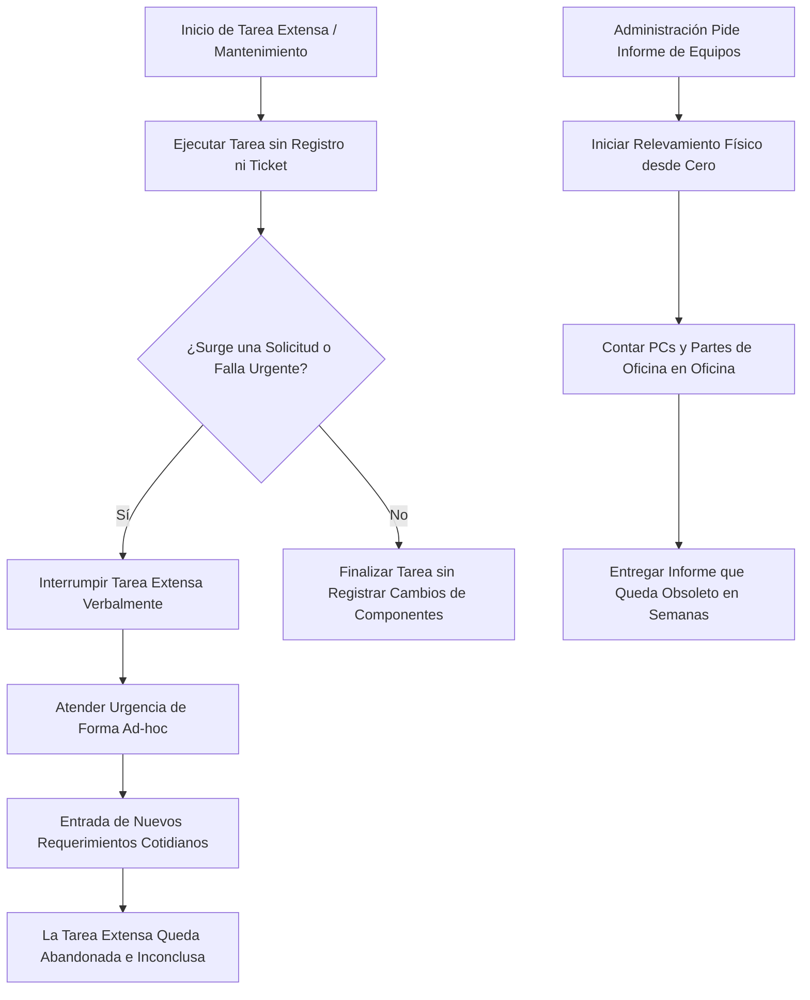

# Etapa 2: Análisis del Flujo de Trabajo y Procesos (AS-IS / TO-BE)

> **Organización:** Dependencia del Ministerio de Educación de Tucumán  
> **Proyecto:** Sistema de Gestión Integral de TI  

---

## 1. Proceso Actual: "AS-IS" (Trabajo Ad-hoc sin Sistema)

Muestra la problemática de tareas extensas interrumpidas que quedan olvidadas y relevamientos manuales repetitivos.



---

## 2. Proceso Propuesto: "TO-BE" (Con Plataforma Web Centralizada)

Muestra el flujo de gestión mediante **Tablero Kanban**, estados de **Pausa/Retoma**, trazabilidad de repuestos y monitoreo preventivo de red.

```mermaid
graph TD
    A[Se Crea Tarea / Solicitud en el Sistema] --> B[Asignar Prioridad: Crítico / Estratégico / Operativo / Opcional]
    B --> C[Tarea Ingresa a Columna 'Pendiente' en Kanban]
    C --> D[Técnico TI Toma Tarea -> Mueve a 'En Proceso']
    
    D --> E{¿Ingresa una Tarea de Prioridad 'Crítica'?}
    E -- Sí --> F[Arrastrar Tarea Actual a Columna 'Pausado']
    F --> G[Ingresar Nota de Avance Obligatoria]
    G --> H[Atender Tarea Crítica -> Resolver]
    H --> I[Cualquier Técnico Visualiza Tarea en 'Pausado']
    I --> J[Presionar 'Retomar' -> Vuelve a 'En Proceso' con Historial]
    J --> K[Finalizar Tarea -> Mover a 'Terminado']

    E -- No --> K

    subgraph MonitoreoPreventivo [Monitoreo de Red & Administración]
        M1[Backend Realiza Ping a Infraestructura / Agente PC envía Latido] --> M2{¿Dispositivo Offline por X días?}
        M2 -- Sí --> M3[Generar Alerta Automática en Kanban (Prioridad Operativa)]
        
        ADM[Área Administrativa] --> ADM2[Consultar Inventario Dinámico en Tiempo Real]
    end
```

---

## 3. Matriz de Transformación de Procesos

| Proceso | Situación Actual (AS-IS) | Situación Propuesta (TO-BE) | Impacto Institucional |
| :--- | :--- | :--- | :--- |
| **Atención de Tareas Largas** | Tareas extensas interrumpidas quedan olvidadas al no haber seguimiento. | Registro en Kanban con estado **Pausado**, nota de avance y fácil reanudación. | Erradicación de mantenimientos de salas incompletos. |
| **Relevamiento de Inventario** | Recorrido físico repetitivo ante cada solicitud de la administración. | Consulta autónoma en línea por el Área Administrativa en tiempo real. | Ahorro masivo de horas-hombre de técnicos y eliminación de demoras. |
| **Sustitución de Hardware** | Pérdida de trazabilidad de componentes usados extraídos de depósito. | Registro de origen obligatorio (`PC Donante/Depósito` vs `Repuesto Nuevo`). | Trazabilidad del patrimonio tecnológico al 100%. |
| **Detección de Fallas** | El usuario nota la falla recién cuando necesita usar el equipo. | Monitoreo por Ping/Agente con **Alertas Preventivas** automáticas. | Soporte proactivo antes de interrumpir la labor docente/administrativa. |
