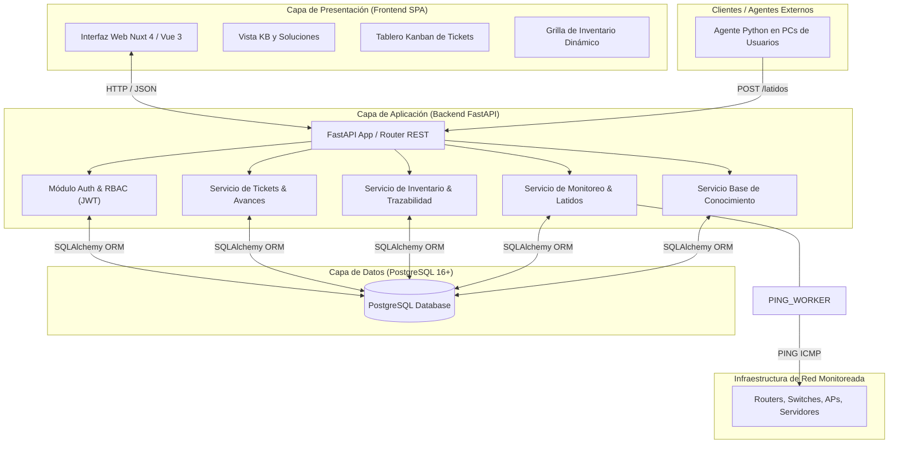

# Etapa 3: Arquitectura del Sistema, Componentes y Listado de Módulos

> **Organización:** Dependencia del Ministerio de Educación de Tucumán  
> **Proyecto:** Sistema de Gestión Integral de TI  
> **Entrega:** Segunda Entrega (Instancia 2 - Análisis y Diseño)

---

## 1. Patrón Arquitectónico del Sistema

El sistema adopta una **Arquitectura en Capas / Cliente-Servidor Desacoplada (Decoupled SPA & REST API Architecture)** empaquetada en contenedores Docker:



---

## 2. 🧩 Listado de Módulos Funcionales del Proyecto

El desarrollo del sistema se ha estructurado en 6 módulos funcionales desacoplados, detallados a continuación con sus prioridades y responsabilidades:

### Módulo 1: Autenticación, Usuarios y Control de Acceso (RBAC)
* **Prioridad:** 🔴 **Crítica (MVP / Core)**
* **Descripción:** Controla la seguridad, emisión de tokens de sesión y asignación de permisos según el perfil del usuario.
* **Funcionalidades Clave:**
  - Login seguro con correo institucional y contraseña encriptada (bcrypt).
  - Emisión y validación de tokens JWT en cada petición API.
  - Gestión de 3 roles principales: `Administrador TI`, `Área Administrativa` y `Usuario Interno`.
  - Middleware de autorización en rutas privadas del Frontend y Backend.

### Módulo 2: Gestión de Inventario Dinámico y Trazabilidad de Componentes
* **Prioridad:** 🔴 **Crítica (MVP / Core)**
* **Descripción:** Registra y audita todas las computadoras, periféricos y partes de hardware de la dependencia.
* **Funcionalidades Clave:**
  - Registro de equipos con ID interno único, N° de Serie, Etiqueta Patrimonial ministerial y atributos dinámicos en **JSONB** (`especificaciones`).
  - Clasificación de estado: `OPERATIVO`, `EN_REPARACION`, `DEPOSITO`, `BAJA`.
  - Asignación de ubicaciones físicas jerárquicas (Edificio, Piso, Oficina, Rack, Depósito) y usuarios responsables.
  - **Trazabilidad de Componentes:** Alta de repuestos (RAM, SSD, Fuentes, CPU) con especificaciones en **JSONB** y registro del origen.
  - Bitácora de traslados de repuestos entre equipos o al depósito con motivo de cambio.

### Módulo 3: Gestión de Tareas y Tickets (Tablero Kanban)
* **Prioridad:** 🔴 **Crítica (MVP / Core)**
* **Descripción:** Módulo central de seguimiento de incidentes y mantenimiento preventivo con tablero colaborativo.
* **Funcionalidades Clave:**
  - Creación de tickets clasificados por **Prioridad Institucional**: `Crítico`, `Estratégico`, `Operativo`, `Opcional`.
  - **Solicitudes de Usuarios:** Formulario simple con descripción libre del problema/equipo sin obligatoriedad de vincular un activo de inventario.
  - **Tablero Kanban visual** con estados: `Pendiente`, `En Proceso`, `En Espera`, `Pausado`, `Cancelado`, `Terminado`.
  - **Pausa obligatoria con Registro de Avance:** Al mover un ticket a `Pausado`, el sistema exige ingresar una nota explicando el avance logrado antes de suspender la tarea.
  - Auto-organización: Cualquier técnico de TI puede visualizar, tomar o reanudar tareas del tablero común.

### Módulo 4: Monitoreo Preventivo de Red y Alertas de Agentes
* **Prioridad:** 🟡 **Alta (Red ICMP) / ⚪ Deseable (Agentes)**
* **Descripción:** Automatiza la detección preventiva de caídas de servicios de red e inactividad prolongada de computadoras.
> 💡 **Nota de Alcance (Nice-to-Have):** Las funcionalidades relacionadas con los agentes de monitoreo en las PCs de usuarios son un *nice-to-have*; su implementación estará acotada y supeditada al avance y consolidación de las funcionalidades principales del sistema (Módulos 1, 2 y 3).
* **Funcionalidades Clave:**
  - **Monitoreo Saliente (Active Polling desde Servidor):** Tarea asíncrona en segundo plano realizada por el **servidor backend** que envía paquetes ICMP Ping hacia dispositivos clave de infraestructura (routers, APs, switches, servidores).
  - **Monitoreo Entrante (Passive Push de Agentes - *Nice-to-Have*):** Recepción de latidos (*heartbeats*) vía `POST /latidos` enviados periódicamente por agentes livianos desde las PCs de los usuarios hacia la API.
  - Emisión automática de alertas en el panel de TI ante caídas de red detectadas por Ping o inactividad prolongada de agentes superior a **5 días hábiles (1 semana)**.

### Módulo 5: Base de Conocimientos y Guías Técnicas (KB)
* **Prioridad:** ⚪ **Baja (Deseable / Opcional)**
* **Descripción:** Repositorio centralizado de procedimientos y soluciones técnicas estandarizadas.
* **Funcionalidades Clave:**
  - Publicación y categorización de guías en formato Markdown (Redes, Hardware, Software).
  - Buscador rápido por palabras clave y tags.
  - Vinculación directa entre un ticket resuelto y un artículo de la KB como solución documentada.

### Módulo 6: Reportes y Panel de Consulta Administrativo
* **Prioridad:** ⚪ **Baja (Deseable / Opcional)**
* **Descripción:** Vista exclusiva simplificada para el Área Administrativa y Directiva.
* **Funcionalidades Clave:**
  - Tablero de consulta en tiempo real del patrimonio tecnológico ministerial.
  - Filtros por sector, estado operativo y antigüedad de equipos.
  - Exportación de reportes tabulados sin requerir relevamientos físicos manuales.

---

## 3. 📁 Estructura del Repositorio

```text
tfi/
├── README.md                              # Documento principal de presentación
├── database/                              # Esquemas, DDL/DML seeds y documentación BD
│   ├── schema.sql                         # Script de creación de tablas e índices
│   ├── seeds.sql                          # Script de carga inicial de datos de prueba
│   └── README.md                          # Guía de ejecución del módulo de BD
├── docker/                                # Dockerfile y docker-compose.yml
│   └── .gitkeep
├── docs/                                  # Documentación de análisis y diseño SDLC
│   ├── 01-planificacion-y-viabilidad/     # Etapa 1: Problema, viabilidad y plan
│   ├── 02-requerimientos-y-analisis/      # Etapa 2: Actores, RF/RNF, Historias de Usuario
│   ├── 03-diseno-y-arquitectura/          # Etapa 3: Stack, Arquitectura, DER, API REST
│   ├── 04-pruebas-y-calidad/              # Etapa 4: Plan de QA (futuro)
│   └── 05-despliegue-y-entrega/           # Etapa 5: Manuales (futuro)
└── src/                                   # Código fuente desacoplado (Carpetas base)
    ├── backend/                           # Estructura inicial API REST (FastAPI)
    └── frontend/                          # Estructura inicial Interfaz SPA (Nuxt 4)
```
