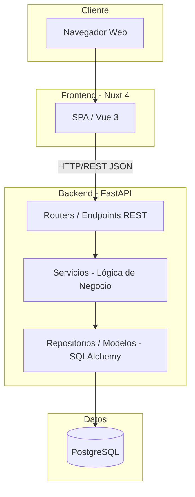
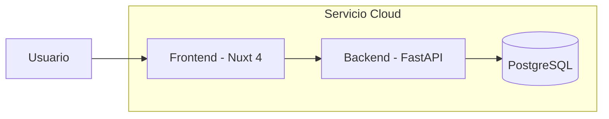

# Arquitectura del Sistema

**Proyecto:** Sistema de Gestión Integral de TI
**Estudiantes:** Diego Cornejo - Daniel Dantur

## Patrón de arquitectura

Se adopta una **arquitectura en capas** con separación entre frontend y backend, comunicados vía API REST:

El backend se organiza internamente en tres capas:
- **Routers (Endpoints):** exponen los recursos REST (usuarios, activos, tickets, monitoreo) y validan entrada/salida con esquemas Pydantic.
- **Servicios:** contienen la lógica de negocio (ej. reglas de asignación de tickets, cálculo de disponibilidad de un dispositivo).
- **Repositorios/Modelos:** acceso a datos mediante SQLAlchemy, mapeando las tablas de PostgreSQL.

El frontend consume la API mediante llamadas HTTP y se organiza en vistas por módulo (Inventario, Tickets, Monitoreo, Dashboard).

## Stack tecnológico definitivo

| Componente | Tecnología | Justificación |
|---|---|---|
| Backend | **FastAPI** (Python) | Tipado con Pydantic, generación automática de documentación OpenAPI/Swagger, alto rendimiento (async) y curva de aprendizaje baja para el equipo. |
| Frontend | **Nuxt 4** (Vue 3) | Framework maduro con buen soporte para SPA, componentes reutilizables y una comunidad amplia; facilita organizar las vistas por módulo. |
| Base de Datos | **PostgreSQL** | Motor relacional robusto, con soporte completo de claves foráneas, índices y transacciones — adecuado para el modelo de datos relacional del inventario y los tickets (relaciones 1-N y N-N bien definidas). |
| Contenerización | **Docker / Docker Compose** | Permite levantar backend, frontend y base de datos con un único comando, garantizando reproducibilidad del entorno para el tutor y para el despliegue final. |
| Despliegue | Contenedores Docker sobre un servicio en la nube (a definir: Render/Railway para backend, Vercel/Netlify para frontend, o un único VPS con docker-compose) | Cumple el requisito de tener al menos un componente accesible online. |

## Diagrama de despliegue (visión general)

## Decisiones de alcance

Conforme a la devolución del tutor sobre no sobredimensionar el proyecto, se optó por:
- Monitoreo de red limitado a **infraestructura** (ping/SNMP), sin agentes en estaciones de usuario.
- Dashboard con **refresco periódico**, sin arquitectura de tiempo real (WebSockets).
- Documentación de procedimientos integrada como campo de notas, sin módulo de base de conocimiento independiente.

Estas decisiones están detalladas en el [Listado de Módulos](./02-listado-de-modulos.md).
