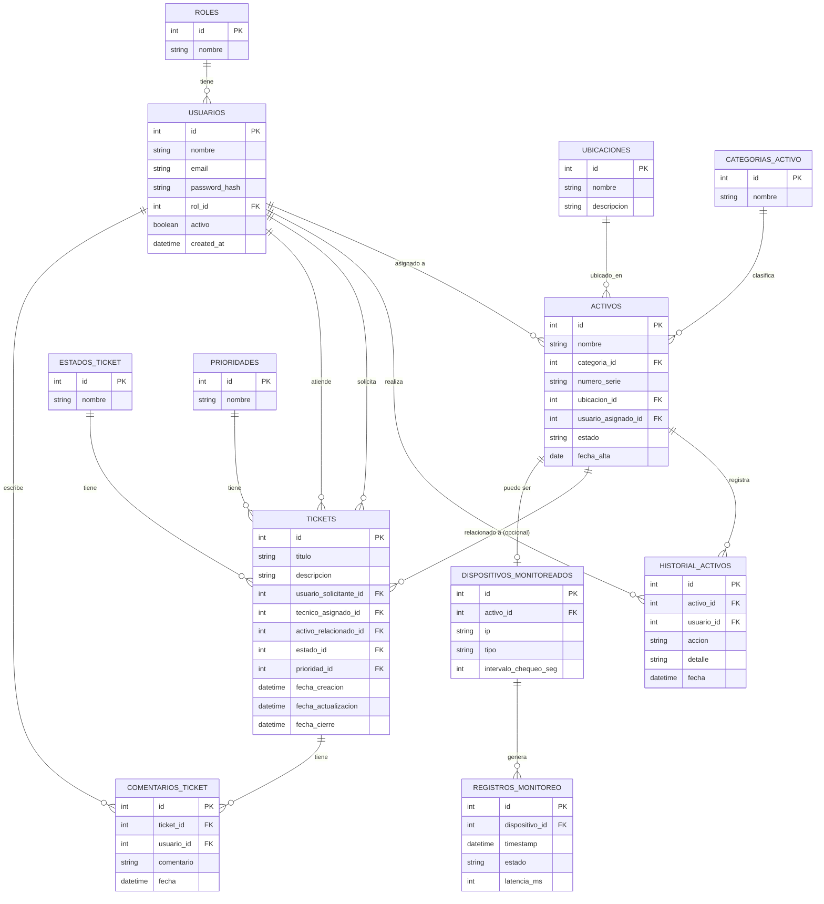

# Esquema de Base de Datos

**Motor:** PostgreSQL (relacional)
**Script DDL:** ver `/database/schema.sql`

## Diagrama Entidad-Relación

## Notas de diseño

- **Claves primarias:** todas las tablas usan `id` autoincremental (`SERIAL`/`BIGSERIAL`) como PK.
- **Claves foráneas:** `usuarios.rol_id → roles.id`, `activos.categoria_id → categorias_activo.id`, `activos.ubicacion_id → ubicaciones.id`, `activos.usuario_asignado_id → usuarios.id`, `tickets.usuario_solicitante_id / tecnico_asignado_id → usuarios.id`, `tickets.activo_relacionado_id → activos.id` (nullable), `tickets.estado_id → estados_ticket.id`, `tickets.prioridad_id → prioridades.id`, `dispositivos_monitoreados.activo_id → activos.id`, `registros_monitoreo.dispositivo_id → dispositivos_monitoreados.id`.
- **Índices principales:** sobre las FK más consultadas (`tickets.estado_id`, `tickets.usuario_solicitante_id`, `registros_monitoreo.dispositivo_id`, `registros_monitoreo.timestamp`) para optimizar los listados y el dashboard.
- **Tablas catálogo** (`roles`, `estados_ticket`, `prioridades`, `categorias_activo`) se modelan como tablas propias (no ENUM) para poder agregar valores sin migrar el esquema.
- **`activo_relacionado_id`** en `tickets` es nullable: un ticket no siempre está asociado a un activo puntual.
- **`dispositivos_monitoreados`** referencia opcionalmente un `activo_id`: permite monitorear infraestructura ya cargada en el inventario sin duplicar datos.
