# Etapa 3: Modelo de Datos (DER y Diccionario)

> **Organización:** Dependencia del Ministerio de Educación de Tucumán  
> **Proyecto:** Sistema de Gestión Integral de TI  
> **Entrega:** Segunda Entrega (Instancia 2 - Análisis y Diseño)

---

## 1. Diagrama Entidad-Relación (DER)

```mermaid
erDiagram
    ROLES ||--|{ USUARIOS : poseen
    UBICACIONES ||--o{ UBICACIONES : contiene
    UBICACIONES ||--o{ USUARIOS : ubicados_en
    UBICACIONES ||--o{ EQUIPOS : albergan
    UBICACIONES ||--o{ COMPONENTES : almacenan_stock
    UBICACIONES ||--o{ HISTORIAL_COMPONENTES : ubicacion_origen
    UBICACIONES ||--o{ HISTORIAL_COMPONENTES : ubicacion_destino

    USUARIOS ||--o{ EQUIPOS : asignados_a
    USUARIOS ||--o{ TICKETS : solicitan
    USUARIOS ||--o{ TICKETS : atienden
    USUARIOS ||--o{ HISTORIAL_TICKETS : registran
    USUARIOS ||--o{ HISTORIAL_COMPONENTES : realizan
    USUARIOS ||--o{ ARTICULOS_KB : redactan
    USUARIOS ||--o{ ALERTAS_SISTEMA : reconocen

    TIPOS_EQUIPO ||--o{ EQUIPOS : clasifica
    EQUIPOS ||--o| MONITOREO_RED : supervisado_por_ping
    EQUIPOS ||--o| ESTADO_AGENTE : reporta_por_agente
    EQUIPOS ||--o{ COMPONENTES : contienen_instalados
    EQUIPOS ||--o{ HISTORIAL_COMPONENTES : equipo_origen
    EQUIPOS ||--o{ HISTORIAL_COMPONENTES : equipo_destino
    EQUIPOS ||--o{ TICKETS : asociados_a
    EQUIPOS ||--o{ ALERTAS_SISTEMA : generan

    TIPOS_COMPONENTE ||--o{ COMPONENTES : clasifica
    COMPONENTES ||--o{ HISTORIAL_COMPONENTES : trazan
    CATEGORIAS_KB ||--|{ ARTICULOS_KB : agrupan
    ARTICULOS_KB ||--o{ TICKETS : resuelven
    TICKETS ||--|{ HISTORIAL_TICKETS : auditan

    ROLES {
        int id PK
        string nombre UK
        string descripcion
    }

    UBICACIONES {
        int id PK
        int ubicacion_padre_id FK "Nullable - Apunta a UBICACIONES.id"
        string nombre "Ej: Edificio A, Oficina 102, Rack Principal"
        tipo_ubicacion_enum tipo_ubicacion "SEDE, EDIFICIO, PISO, OFICINA, DEPOSITO, ARMARIO, RACK"
        string ruta_jerarquica "Ej: /1/4/12/ (Materialized Path)"
        string descripcion
    }

    USUARIOS {
        int id PK
        string nombre
        string apellido
        string email UK
        string password_hash
        int rol_id FK
        int ubicacion_id FK "Nullable"
        boolean activo
        datetime creado_en
    }

    TIPOS_EQUIPO {
        int id PK
        string nombre UK "PC, IMPRESORA, SWITCH, PROYECTOR, UPS, SERVIDOR"
        string icono
        jsonb esquema_especificaciones "Define qué campos dinámicos pedir en el form"
    }

    EQUIPOS {
        int id PK
        int tipo_equipo_id FK "Apunta al catálogo TIPOS_EQUIPO"
        string codigo_inventario UK
        string marca
        string modelo
        jsonb especificaciones "Validado contra TIPOS_EQUIPO.esquema_especificaciones"
        estado_equipo_enum estado "OPERATIVO, EN_REPARACION, EN_DEPOSITO, BAJA"
        string posicion_detalle "Ej: Unidad 14U, Puesto 3"
        date fecha_alta
        int ubicacion_id FK
        int usuario_asignado_id FK "Nullable"
    }

    MONITOREO_RED {
        int id PK
        int equipo_id FK, UK "Relación 1 a 0..1 con EQUIPOS"
        string hostname_red
        string direccion_ip UK
        string mac_address UK
        int intervalo_ping_seg
        datetime ultimo_ping
        boolean estado_online
        int umbral_dias_offline
    }

    ESTADO_AGENTE {
        int id PK
        int equipo_id FK, UK "Relación 1 a 0..1 - Siempre 1 fila por PC"
        string hostname_reportado
        string ip_local_reportada "Se actualiza sola si cambia por DHCP"
        string usuario_so_actual "Qué usuario inició sesión en la PC"
        string version_agente
        numeric disco_libre_gb
        jsonb metricas_extra "Ej: SO, uptime, CPU/RAM, discos secundarios"
        datetime ultimo_latido
        int umbral_dias_inactivo "Para alertar si la PC no prende en X días"
    }

    TIPOS_COMPONENTE {
        int id PK
        string nombre UK "RAM, ALMACENAMIENTO, CPU, FUENTE, PLACA_RED"
        jsonb esquema_especificaciones "Ej: capacidad_gb, frecuencia_mhz, tecnologia"
    }

    COMPONENTES {
        int id PK
        int tipo_componente_id FK "Apunta al catálogo TIPOS_COMPONENTE"
        string codigo_componente UK
        string marca_modelo
        jsonb especificaciones "Validado contra TIPOS_COMPONENTE.esquema_especificaciones"
        estado_componente_enum estado "DISPONIBLE, INSTALADO, DEFECTUOSO, BAJA"
        string origen
        date fecha_instalacion "Nullable"
        int equipo_id FK "Nullable - XOR con ubicacion_id"
        int ubicacion_id FK "Nullable - XOR con equipo_id (Depósito/Estante)"
    }

    HISTORIAL_COMPONENTES {
        int id PK
        int componente_id FK
        int equipo_origen_id FK "Nullable"
        int ubicacion_origen_id FK "Nullable"
        int equipo_destino_id FK "Nullable"
        int ubicacion_destino_id FK "Nullable"
        int usuario_tecnico_id FK
        string motivo_movimiento
        datetime fecha_movimiento
    }

    CATEGORIAS_KB {
        int id PK
        string nombre UK
        string descripcion
        string icono
    }

    ARTICULOS_KB {
        int id PK
        int categoria_id FK
        int autor_id FK
        string titulo
        string slug UK
        text contenido_markdown
        string tags
    }

    TICKETS {
        int id PK
        string codigo_ticket UK
        string titulo
        text descripcion
        prioridad_ticket_enum prioridad "OPCIONAL, OPERATIVO, ESTRATÉGICO, CRÍTICO"
        estado_ticket_enum estado "PENDIENTE, EN_PROGRESO, EN_ESPERA, PAUSADO, CANCELADO, RESUELTO"
        int solicitante_id FK
        int tecnico_asignado_id FK "Nullable"
        int equipo_id FK "Nullable"
        int procedimiento_kb_id FK "Nullable"
        datetime fecha_creacion
        datetime fecha_actualizacion
        datetime fecha_cierre "Nullable"
    }

    HISTORIAL_TICKETS {
        int id PK
        int ticket_id FK
        int usuario_id FK
        string estado_anterior
        string estado_nuevo
        text nota_avance
        datetime fecha_cambio
    }

    ALERTAS_SISTEMA {
        int id PK
        int equipo_id FK "Origen único unificado"
        int usuario_id FK "Nullable"
        string tipo_alerta "PING_TIMEOUT, INACTIVIDAD_DIAS, UMBRAL_HARDWARE"
        nivel_alerta_enum nivel "INFO, ADVERTENCIA, CRÍTICO"
        text mensaje
        boolean atendida
        datetime fecha_alerta
        datetime fecha_atencion "Nullable"
    }
```



---

## 2. Tipos ENUM Nativos de PostgreSQL

Para mayor integridad de datos y rendimiento, se definen los siguientes **ENUMs nativos**:

```sql
CREATE TYPE estado_equipo_enum AS ENUM ('OPERATIVO', 'EN_REPARACION', 'EN_DEPOSITO', 'BAJA');
CREATE TYPE estado_componente_enum AS ENUM ('DISPONIBLE', 'INSTALADO', 'DEFECTUOSO', 'BAJA');
CREATE TYPE estado_ticket_enum AS ENUM ('PENDIENTE', 'EN_PROGRESO', 'EN_ESPERA', 'PAUSADO', 'CANCELADO', 'RESUELTO');
CREATE TYPE prioridad_ticket_enum AS ENUM ('OPCIONAL', 'OPERATIVO', 'ESTRATÉGICO', 'CRÍTICO');
CREATE TYPE tipo_ubicacion_enum AS ENUM ('SEDE', 'EDIFICIO', 'PISO', 'OFICINA', 'DEPOSITO', 'ARMARIO', 'RACK');
CREATE TYPE nivel_alerta_enum AS ENUM ('INFO', 'ADVERTENCIA', 'CRÍTICO');
```

---

## 3. Recepción de Latidos de Agentes (`UPSERT` Atómico)

Cada vez que el agente de una PC envía su reporte de telemetría (cada 5 minutos), el backend ejecuta una sola operación atómica `UPSERT` en la tabla `estado_agente`:

```sql
INSERT INTO estado_agente (
    equipo_id, hostname_reportado, ip_local_reportada, usuario_so_actual,
    version_agente, disco_libre_gb, metricas_extra, ultimo_latido
) VALUES (
    $1, $2, $3, $4, $5, $6, $7, NOW()
)
ON CONFLICT (equipo_id) DO UPDATE SET
    hostname_reportado   = EXCLUDED.hostname_reportado,
    ip_local_reportada   = EXCLUDED.ip_local_reportada,
    usuario_so_actual    = EXCLUDED.usuario_so_actual,
    version_agente       = EXCLUDED.version_agente,
    disco_libre_gb       = EXCLUDED.disco_libre_gb,
    metricas_extra       = EXCLUDED.metricas_extra,
    ultimo_latido        = NOW();
```

---

## 4. Diccionario de Datos

### 4.1 Tabla Catálogo: `tipos_equipo`
| Campo | Tipo de Dato | Clave | Nulo | Descripción / Restricciones |
| :--- | :--- | :---: | :---: | :--- |
| `id` | `SERIAL` | **PK** | No | Identificador del tipo de equipo. |
| `nombre` | `VARCHAR(100)` | **UNIQUE** | No | Nombre del tipo (`PC`, `IMPRESORA`, `SWITCH`, `PROYECTOR`, `UPS`, `SERVIDOR`). |
| `icono` | `VARCHAR(50)` | - | Sí | Nombre del icono de interfaz. |
| `esquema_especificaciones`|`JSONB` | - | Sí | Define la estructura de campos requeridos para formularios del Frontend. |

### 4.2 Tabla Catálogo: `tipos_componente`
| Campo | Tipo de Dato | Clave | Nulo | Descripción / Restricciones |
| :--- | :--- | :---: | :---: | :--- |
| `id` | `SERIAL` | **PK** | No | Identificador del tipo de componente. |
| `nombre` | `VARCHAR(100)` | **UNIQUE** | No | Nombre del tipo (`RAM`, `ALMACENAMIENTO`, `CPU`, `FUENTE`, `PLACA_RED`). |
| `esquema_especificaciones`|`JSONB` | - | Sí | Define los atributos requeridos (`capacidad_gb`, `frecuencia_mhz`, `tecnologia`, etc.). |

### 4.3 Tabla: `roles`
| Campo | Tipo de Dato | Clave | Nulo | Descripción / Restricciones |
| :--- | :--- | :---: | :---: | :--- |
| `id` | `SERIAL` | **PK** | No | Identificador único incremental. |
| `nombre` | `VARCHAR(50)` | **UNIQUE** | No | Perfil (`Administrador TI`, `Área Administrativa`, `Usuario Interno`). |
| `descripcion` | `TEXT` | - | Sí | Descripción de alcances del rol. |

### 4.4 Tabla: `ubicaciones` (Estructura Jerárquica de Árbol)
| Campo | Tipo de Dato | Clave | Nulo | Descripción / Restricciones |
| :--- | :--- | :---: | :---: | :--- |
| `id` | `SERIAL` | **PK** | No | Identificador único de la ubicación. |
| `ubicacion_padre_id`|`INT` | **FK** | Sí | Autorreferencial (`ubicaciones.id`). NULL indica nodo raíz. |
| `nombre` | `VARCHAR(100)` | - | No | Nombre del sector (ej. Sede Central, Piso 1, Oficina 102, Rack 2). |
| `tipo_ubicacion` | `tipo_ubicacion_enum`| - | No | Nivel jerárquico (`SEDE`, `EDIFICIO`, `PISO`, `OFICINA`, `DEPOSITO`, `ARMARIO`, `RACK`). |
| `ruta_jerarquica` | `VARCHAR(255)`| - | Sí | Materialized Path para búsqueda eficiente (ej. `/1/4/12/`). |
| `descripcion` | `TEXT` | - | Sí | Notas descriptivas del espacio físico. |

### 4.5 Tabla: `usuarios`
| Campo | Tipo de Dato | Clave | Nulo | Descripción / Restricciones |
| :--- | :--- | :---: | :---: | :--- |
| `id` | `SERIAL` | **PK** | No | Identificador del usuario. |
| `nombre` | `VARCHAR(100)` | - | No | Nombre del usuario. |
| `apellido` | `VARCHAR(100)` | - | No | Apellido del usuario. |
| `email` | `VARCHAR(150)` | **UNIQUE** | No | Correo institucional. |
| `password_hash` | `VARCHAR(255)` | - | No | Contraseña encriptada con bcrypt. |
| `rol_id` | `INT` | **FK** | No | Referencia a `roles.id`. |
| `ubicacion_id` | `INT` | **FK** | Sí | Referencia a `ubicaciones.id` (Ubicación de trabajo). |
| `activo` | `BOOLEAN` | - | No | Estado de la cuenta (Default `TRUE`). |
| `creado_en` | `TIMESTAMP` | - | No | Fecha de registro. |

### 4.6 Tabla: `equipos`
| Campo | Tipo de Dato | Clave | Nulo | Descripción / Restricciones |
| :--- | :--- | :---: | :---: | :--- |
| `id` | `SERIAL` | **PK** | No | Identificador del equipo. |
| `tipo_equipo_id` | `INT` | **FK** | No | Referencia al catálogo `tipos_equipo.id`. |
| `codigo_inventario`| `VARCHAR(50)` | **UNIQUE** | No | Código único interno (ej: `EQ-PC-001`). |
| `numero_serie` | `VARCHAR(100)` | - | Sí | N° de Serie grabado por el fabricante. |
| `etiqueta_patrimonial`|`VARCHAR(100)`| - | Sí | Chapa o código patrimonial del Ministerio. |
| `marca` | `VARCHAR(100)` | - | No | Marca del equipo. |
| `modelo` | `VARCHAR(100)` | - | No | Modelo específico. |
| `especificaciones` | `JSONB` | - | Sí | Atributos dinámicos en JSONB (Índice GIN), validados contra `tipos_equipo.esquema_especificaciones`. |
| `estado` | `estado_equipo_enum`| - | No | ENUM nativo (`OPERATIVO`, `EN_REPARACION`, `EN_DEPOSITO`, `BAJA`). |
| `posicion_detalle` | `VARCHAR(100)` | - | Sí | Detalle dentro de la ubicación (ej. `Unidad 14U`, `Puesto 3`). |
| `fecha_alta` | `DATE` | - | No | Fecha de alta en el sistema. |
| `ubicacion_id` | `INT` | **FK** | No | Referencia a `ubicaciones.id`. |
| `usuario_asignado_id`|`INT` | **FK** | Sí | Referencia a `usuarios.id`. |

### 4.7 Tabla: `monitoreo_red` (Supervisión Activa Ping)
| Campo | Tipo de Dato | Clave | Nulo | Descripción / Restricciones |
| :--- | :--- | :---: | :---: | :--- |
| `id` | `SERIAL` | **PK** | No | Identificador del registro de monitoreo. |
| `equipo_id` | `INT` | **FK, UNIQUE** | No | Referencia 1 a 0..1 con `equipos.id`. |
| `hostname_red` | `VARCHAR(100)` | - | Sí | Nombre de host en red local. |
| `direccion_ip` | `VARCHAR(45)` | **UNIQUE** | No | IP asignada para ping ICMP. |
| `mac_address` | `VARCHAR(17)` | **UNIQUE** | Sí | Dirección MAC física. |
| `intervalo_ping_seg`|`INT` | - | No | Frecuencia de chequeo en segundos. |
| `ultimo_ping` | `TIMESTAMP` | - | Sí | Timestamp de última respuesta. |
| `estado_online` | `BOOLEAN` | - | No | Estado actual de conexión (`TRUE`/`FALSE`). |
| `umbral_dias_offline`|`INT` | - | No | Días tolerados antes de generar alerta por inactividad. |

### 4.8 Tabla: `estado_agente` (Telemetría Pasiva Agente)
| Campo | Tipo de Dato | Clave | Nulo | Descripción / Restricciones |
| :--- | :--- | :---: | :---: | :--- |
| `id` | `SERIAL` | **PK** | No | Identificador del estado de agente. |
| `equipo_id` | `INT` | **FK, UNIQUE** | No | Referencia 1 a 0..1 con `equipos.id`. |
| `hostname_reportado`|`VARCHAR(100)`| - | No | Hostname reportado por el agente cliente. |
| `ip_local_reportada`|`VARCHAR(45)` | - | No | Dirección IP local. |
| `usuario_so_actual`|`VARCHAR(100)`| - | Sí | Usuario que inició sesión en el Sistema Operativo. |
| `version_agente` | `VARCHAR(20)` | - | No | Versión instalada del cliente de monitoreo. |
| `disco_libre_gb` | `NUMERIC(8,2)` | - | Sí | Espacio disponible en disco principal GB. |
| `metricas_extra` | `JSONB` | - | Sí | Métricas adicionales (SO, uptime, CPU/RAM, discos secundarios, etc.). |
| `ultimo_latido` | `TIMESTAMP` | - | No | Timestamp del último reporte recibido (`UPSERT`). |
| `umbral_dias_inactivo`|`INT` | - | No | Días sin latido tolerados antes de alertar inactividad. |

### 4.9 Tabla: `componentes`
| Campo | Tipo de Dato | Clave | Nulo | Descripción / Restricciones |
| :--- | :--- | :---: | :---: | :--- |
| `id` | `SERIAL` | **PK** | No | Identificador del componente. |
| `tipo_componente_id`|`INT` | **FK** | No | Referencia al catálogo `tipos_componente.id`. |
| `codigo_componente`|`VARCHAR(50)` | **UNIQUE** | No | Código interno del repuesto. |
| `marca_modelo` | `VARCHAR(150)` | - | No | Especificación técnica principal. |
| `especificaciones` | `JSONB` | - | Sí | Atributos dinámicos en JSONB (Índice GIN). |
| `estado` | `estado_componente_enum`| - | No | ENUM nativo (`DISPONIBLE`, `INSTALADO`, `DEFECTUOSO`, `BAJA`). |
| `origen` | `VARCHAR(50)` | - | No | Origen (`Compra Nueva`, `Donacion`, `Reciclado Deposito`). |
| `fecha_instalacion`| `DATE` | - | Sí | Fecha de colocación (si está instalado). |
| `equipo_id` | `INT` | **FK** | Sí | Referencia a `equipos.id` (**XOR con `ubicacion_id`**). |
| `ubicacion_id` | `INT` | **FK** | Sí | Referencia a `ubicaciones.id` (**XOR con `equipo_id`**). |

### 4.10 Tabla: `historial_componentes`
| Campo | Tipo de Dato | Clave | Nulo | Descripción / Restricciones |
| :--- | :--- | :---: | :---: | :--- |
| `id` | `SERIAL` | **PK** | No | Identificador del historial de movimiento. |
| `componente_id` | `INT` | **FK** | No | Referencia al componente trasladado. |
| `equipo_origen_id` | `INT` | **FK** | Sí | Equipo de origen (si estaba instalado). |
| `ubicacion_origen_id`|`INT` | **FK** | Sí | Ubicación física de origen. |
| `equipo_destino_id`| `INT` | **FK** | Sí | Equipo de destino. |
| `ubicacion_destino_id`|`INT` | **FK** | Sí | Ubicación física de destino. |
| `usuario_tecnico_id`|`INT` | **FK** | No | Técnico que realizó el movimiento. |
| `motivo_movimiento`| `TEXT` | - | No | Explicación del cambio o traslado. |
| `fecha_movimiento` | `TIMESTAMP` | - | No | Momento del movimiento. |

### 4.11 Tabla: `categorias_kb`
| Campo | Tipo de Dato | Clave | Nulo | Descripción / Restricciones |
| :--- | :--- | :---: | :---: | :--- |
| `id` | `SERIAL` | **PK** | No | Identificador de categoría KB. |
| `nombre` | `VARCHAR(100)` | **UNIQUE** | No | Nombre de la categoría. |
| `descripcion` | `TEXT` | - | Sí | Descripción. |
| `icono` | `VARCHAR(50)` | - | Sí | Icono descriptivo. |

### 4.12 Tabla: `articulos_kb`
| Campo | Tipo de Dato | Clave | Nulo | Descripción / Restricciones |
| :--- | :--- | :---: | :---: | :--- |
| `id` | `SERIAL` | **PK** | No | Identificador del artículo. |
| `categoria_id` | `INT` | **FK** | No | Categoría asociada. |
| `autor_id` | `INT` | **FK** | No | Técnico autor del artículo. |
| `titulo` | `VARCHAR(200)` | - | No | Título de la guía. |
| `slug` | `VARCHAR(220)` | **UNIQUE** | No | URL slug amigable. |
| `contenido_markdown`|`TEXT` | - | No | Procedimiento en formato Markdown. |
| `tags` | `VARCHAR(200)` | - | Sí | Palabras clave. |

### 4.13 Tabla: `tickets`
| Campo | Tipo de Dato | Clave | Nulo | Descripción / Restricciones |
| :--- | :--- | :---: | :---: | :--- |
| `id` | `SERIAL` | **PK** | No | Identificador del ticket. |
| `codigo_ticket` | `VARCHAR(20)` | **UNIQUE** | No | Código único (ej. `TICK-2026-001`). |
| `titulo` | `VARCHAR(200)` | - | No | Título representativo. |
| `descripcion` | `TEXT` | - | No | Detalle del problema. |
| `prioridad` | `prioridad_ticket_enum`| - | No | ENUM nativo (`OPCIONAL`, `OPERATIVO`, `ESTRATÉGICO`, `CRÍTICO`). |
| `estado` | `estado_ticket_enum` | - | No | ENUM nativo (`PENDIENTE`, `EN_PROGRESO`, `EN_ESPERA`, `PAUSADO`, `CANCELADO`, `RESUELTO`). |
| `solicitante_id` | `INT` | **FK** | No | Usuario solicitante. |
| `tecnico_asignado_id`|`INT` | **FK** | Sí | Técnico asignado. |
| `equipo_id` | `INT` | **FK** | Sí | Equipo de inventario involucrado. |
| `procedimiento_kb_id`|`INT` | **FK** | Sí | Solución KB aplicada. |

### 4.14 Tabla: `historial_tickets`
| Campo | Tipo de Dato | Clave | Nulo | Descripción / Restricciones |
| :--- | :--- | :---: | :---: | :--- |
| `id` | `SERIAL` | **PK** | No | Identificador del historial de cambio. |
| `ticket_id` | `INT` | **FK** | No | Ticket auditado. |
| `usuario_id` | `INT` | **FK** | No | Usuario que ejecutó el cambio. |
| `estado_anterior` | `VARCHAR(30)` | - | Sí | Estado previo. |
| `estado_nuevo` | `VARCHAR(30)` | - | No | Nuevo estado asignado. |
| `nota_avance` | `TEXT` | - | Sí | Nota obligatoria al pasar a `PAUSADO`. |
| `fecha_cambio` | `TIMESTAMP` | - | No | Fecha del cambio. |

### 4.15 Tabla: `alertas_sistema`
| Campo | Tipo de Dato | Clave | Nulo | Descripción / Restricciones |
| :--- | :--- | :---: | :---: | :--- |
| `id` | `SERIAL` | **PK** | No | Identificador de la alerta. |
| `equipo_id` | `INT` | **FK** | No | Equipo de origen único. |
| `usuario_id` | `INT` | **FK** | Sí | Técnico usuario que atendió la alerta. |
| `tipo_alerta` | `VARCHAR(50)` | - | No | Tipo (`PING_TIMEOUT`, `INACTIVIDAD_DIAS`, `UMBRAL_HARDWARE`). |
| `nivel` | `nivel_alerta_enum` | - | No | ENUM nativo (`INFO`, `ADVERTENCIA`, `CRÍTICO`). |
| `mensaje` | `TEXT` | - | No | Mensaje informativo. |
| `atendida` | `BOOLEAN` | - | No | Estado de atención (`TRUE`/`FALSE`). |
| `fecha_alerta` | `TIMESTAMP` | - | No | Fecha de disparo. |
| `fecha_atencion` | `TIMESTAMP` | - | Sí | Fecha de atención. |

---

## 5. Scripts SQL y Migraciones

Todos los scripts ejecutables de creación de base de datos se encuentran ubicados en el repositorio:
* 📄 [`/database/schema.sql`](../../database/schema.sql) - ENUMs, tablas, FKs e Índices.
* 📄 [`/database/seeds.sql`](../../database/seeds.sql) - Catálogo inicial de tipos de equipo/componente y datos de prueba.
