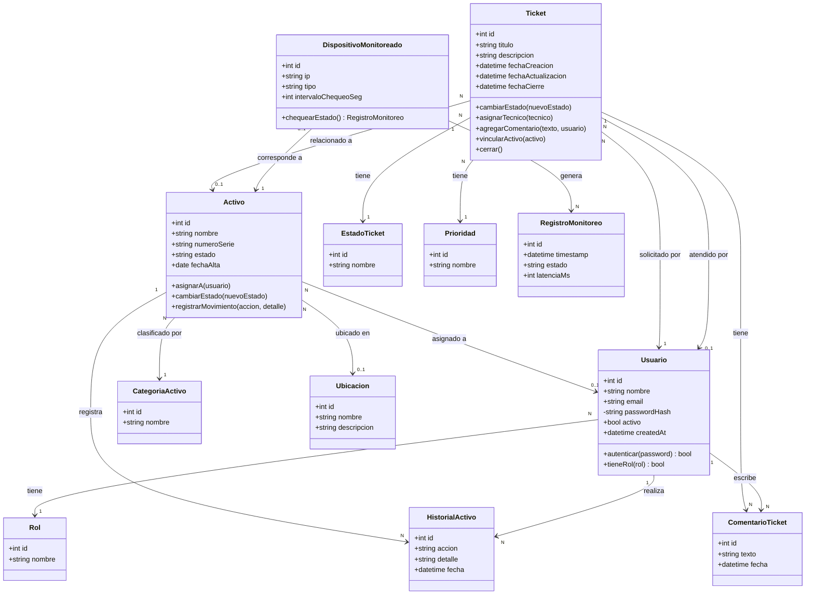

# Diagrama de Clases (Modelo de Dominio)

Este diagrama representa las entidades del dominio de la aplicación, sus atributos, comportamiento principal y relaciones. Es el modelo orientado a objetos que luego se traduce a modelos de datos (SQLAlchemy) y al esquema relacional (ver `03-esquema-base-datos.md`).

## Notas

- Los métodos listados representan el comportamiento de negocio esperado, no necesariamente firmas finales de código.
- Las clases catálogo (`Rol`, `CategoriaActivo`, `EstadoTicket`, `Prioridad`) son simples porque su función es solo tipificar a otras entidades.
- Este modelo de dominio es la base para las clases/modelos que se implementarán en el backend (SQLAlchemy + Pydantic sobre FastAPI); el mapeo a tablas relacionales está en `03-esquema-base-datos.md`.
