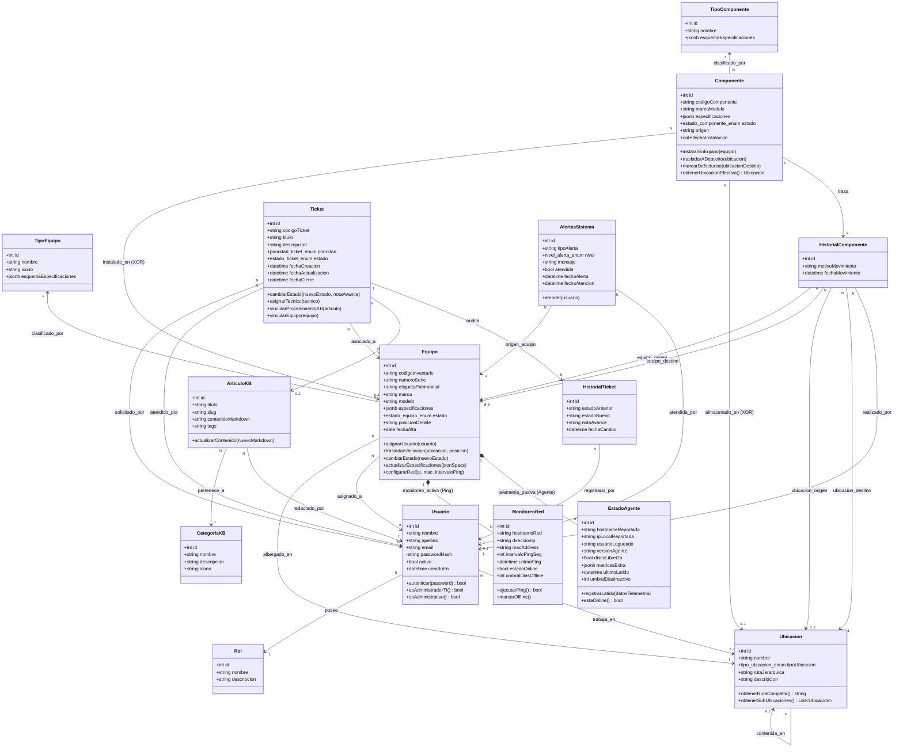

# Etapa 3: Diagrama de Clases (Modelo de Dominio Orientado a Objetos)

> **Organización:** Dependencia del Ministerio de Educación de Tucumán  
> **Proyecto:** Sistema de Gestión Integral de TI  
> **Entrega:** Segunda Entrega (Instancia 2 - Análisis y Diseño)

---

## 1. Presentación del Modelo de Clases

Este diagrama representa el **Modelo de Dominio Orientado a Objetos (OOD)** del sistema. Define las entidades conceptuales, sus atributos (con visibilidad pública/privada), métodos principales de negocio y las asociaciones entre clases.

Sirve de puente conceptual entre los Requerimientos Funcionales (`docs/02-requerimientos-y-analisis/02-requerimientos-funcionales-y-no-funcionales.md`), los modelos ORM que se implementarán en FastAPI (SQLAlchemy / Pydantic) y el esquema relacional PostgreSQL (`/database/schema.sql`).

---

## 2. Diagrama de Clases en Mermaid

---

## 3. Descripción de Clases Principales y Responsabilidades

### 3.1 Módulo de Seguridad y Usuarios (`Usuario`, `Rol`)
* **`Usuario`**: Modela a las personas registradas en el sistema. Métodos para autenticar contraseña y validar rol asignado. Se relaciona opcionalmente a una `Ubicacion` de trabajo física.
* **`Rol`**: Modela los perfiles de acceso (`Administrador TI`, `Área Administrativa`, `Usuario Interno`).

### 3.2 Módulo de Ubicaciones y Granularidad Jerárquica (`Ubicacion`)
* **`Ubicacion`**: Implementa el patrón jerárquico de árbol (auto-referencial `contenida_en`). Utiliza el enum `tipo_ubicacion_enum` (`SEDE`, `EDIFICIO`, `PISO`, `OFICINA`, `DEPOSITO`, `ARMARIO`, `RACK`).
* **Métodos**: `+obtenerRutaCompleta()` concatena los nombres según el Materialized Path `rutaJerarquica` (ej: `Sede Central / Piso 1 / Sala de Servidores / Rack Principal`), y `+obtenerSubUbicaciones()` retorna las ubicaciones hijas contenidas.

### 3.3 Módulo de Catálogos y Formularios Dinámicos (`TipoEquipo`, `TipoComponente`)
* **`TipoEquipo`**: Catálogo de clasificadores de hardware (`PC`, `IMPRESORA`, `SWITCH`, `PROYECTOR`, `UPS`, `SERVIDOR`). Contiene `esquemaEspecificaciones` en **JSONB** para generar dinámicamente los formularios del Frontend.
* **`TipoComponente`**: Catálogo de repuestos (`RAM`, `ALMACENAMIENTO`, `CPU`, `FUENTE`, `PLACA_RED`). Almacena los esquemas de especificaciones técnicas.

### 3.4 Módulo de Inventario Dinámico y Trazabilidad de Hardware (`Equipo`, `Componente`, `HistorialComponente`)
* **`Equipo`**: Representa cualquier equipo físico clasificado por `TipoEquipo`. Atributo `estado` de tipo `estado_equipo_enum` (`OPERATIVO`, `EN_REPARACION`, `EN_DEPOSITO`, `BAJA`).
* **`Componente`**: Representa repuestos internos. Atributo `estado` de tipo `estado_componente_enum` (`DISPONIBLE`, `INSTALADO`, `DEFECTUOSO`, `BAJA`). Implementa relación XOR entre `Equipo` y `Ubicacion` de stock.
* **`HistorialComponente`**: Clase de auditoría que registra los movimientos de partes entre equipos y/o ubicaciones físicas.

### 3.5 Módulo de Monitoreo Preventivo y Telemetría (`MonitoreoRed`, `EstadoAgente`, `AlertasSistema`)
* **`MonitoreoRed`**: Composición 1 a 0..1 del `Equipo` para supervisión activa ICMP Ping.
* **`EstadoAgente`**: Composición 1 a 0..1 del `Equipo` que mantiene el estado actual de telemetría pasiva reportado por el agente cliente en cada estación de trabajo.
* **`AlertasSistema`**: Alertas preventivas emitidas automáticamente utilizando el enum `nivel_alerta_enum` (`INFO`, `ADVERTENCIA`, `CRÍTICO`).

### 3.6 Módulo de Tareas y Soporte (`Ticket`, `HistorialTicket`)
* **`Ticket`**: Representa las solicitudes de soporte del Tablero Kanban. Utiliza los enums `prioridad_ticket_enum` (`OPCIONAL`, `OPERATIVO`, `ESTRATÉGICO`, `CRÍTICO`) y `estado_ticket_enum` (`PENDIENTE`, `EN_PROGRESO`, `EN_ESPERA`, `PAUSADO`, `CANCELADO`, `RESUELTO`).
* **`HistorialTicket`**: Registra la bitácora cronológica de transiciones de estado de cada ticket.

### 3.7 Módulo de Base de Conocimiento (`ArticuloKB`, `CategoriaKB`)
* **`ArticuloKB`**: Modela procedimientos y soluciones técnicas en Markdown asociables a tickets resueltos.
